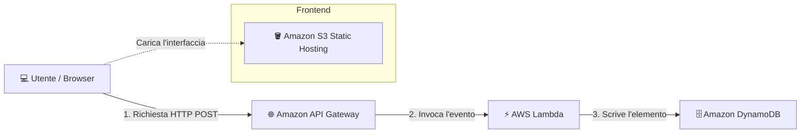

# 🚀 AWS Serverless Event Tracker

## 📌 Descrizione del Progetto

Progetto pratico focalizzato sulla progettazione e implementazione di un'architettura web **Serverless, scalable e event-driven** su Amazon Web Services (AWS) per il tracciamento delle visite in tempo reale.

Invece di utilizzare un server sempre attivo (come EC2), l'infrastruttura sfrutta un approccio **100% Serverless**: un frontend statico ospitato su **Amazon S3** invia richieste asincrone tramite **Amazon API Gateway**, scatenando l'esecuzione di una funzione **AWS Lambda** che gestisce la logica di backend e salva i record su **Amazon DynamoDB**.

---

## 🏗️ Architettura e Componenti

- **Amazon S3 (Static Website Hosting)**: Punto di ingresso del frontend. Ospita i file statici (`index.html`) rendendoli accessibili via web grazie a una Bucket Policy di lettura pubblica.
- **Amazon API Gateway (HTTP API)**: Gestisce l'endpoint HTTP (`/visit`), la configurazione dei permessi CORS (Cross-Origin Resource Sharing) e smista il traffico in entrata verso la funzione Lambda.
- **AWS Lambda**: Componente di calcolo serverless event-driven. Riceve la richiesta da API Gateway, genera un ID univoco con timestamp ed esegue la scrittura sul database NoSQL.
- **Amazon DynamoDB**: Database NoSQL fully-managed a chiavi-valore. Memorizza in modo persistente i dati delle visite ricevuti da Lambda con scalabilità automatica.
- **AWS IAM (Identity and Access Management)**: Ruolo di esecuzione dedicato applicato a Lambda per consentire la sola scrittura (`dynamodb:PutItem`) sulla tabella, garantendo il principio del minimo privilegio.

---

## 📐 Schema dell'Architettura

📷 Evidenze di Configurazione
1. Interfaccia Web Static Hosting (S3)
(Aggiungi qui lo screenshot della tua pagina web aperta nel browser)

2. Rotta e Integrazione API Gateway
(Aggiungi qui lo screenshot della console di API Gateway con la rotta /visit)

3. Record Salvati su Tabella DynamoDB
(Aggiungi qui lo screenshot degli items salvati su DynamoDB)

---

📜 Codice di Backend (AWS Lambda - Node.js)
import { DynamoDBClient } from "@aws-sdk/client-dynamodb";
import { PutCommand, DynamoDBDocumentClient } from "@aws-sdk/lib-dynamodb";

const client = new DynamoDBClient({});
const docClient = DynamoDBDocumentClient.from(client);

export const handler = async (event) => {
    const visitId = Date.now().toString();
    
    const params = {
        TableName: "NOME_DELLA_TUA_TABELLA_DYNAMODB",
        Item: {
            VisitID: visitId,
            Timestamp: new Date().toISOString()
        }
    };

    try {
        await docClient.send(new PutCommand(params));
        return {
            statusCode: 200,
            headers: { "Content-Type": "application/json" },
            body: JSON.stringify({ message: "Visita registrata con successo!", visitId }),
        };
    } catch (error) {
        return {
            statusCode: 500,
            body: JSON.stringify({ error: error.message }),
        };
    }
};
