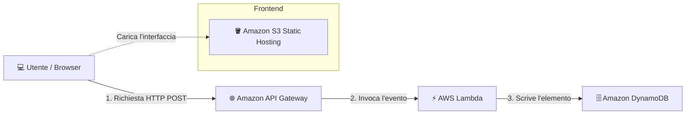

# 🚀 AWS Serverless Event Tracker

Un'applicazione web serverless full-stack realizzata su AWS che traccia le visite al sito in tempo reale. Questo progetto dimostra un'architettura cloud event-driven, l'integrazione di API e la persistenza dei dati su un database NoSQL.

---

## 🏗️ Schema dell'Architettura

🛠️ Servizi AWS e Stack Tecnologico
Amazon S3: Ospita il frontend statico (index.html) configurato con Bucket Policy di lettura pubblica.

Amazon API Gateway: HTTP API per la gestione delle rotte e della configurazione CORS.

AWS Lambda: Funzione serverless (Node.js/Python) per l'esecuzione della logica di backend.

Amazon DynamoDB: Database NoSQL Key-Value per il salvataggio dei log delle visite con timestamp univoci.

AWS IAM: Ruoli di esecuzione configurati secondo il principio del minimo privilegio.

📸 Screenshot e Dimostrazione
1. Interfaccia Frontend (Ospitata su S3)
(Aggiungi qui la foto del sito web caricato su S3)

2. Record della Tabella DynamoDB
(Aggiungi qui lo screenshot di DynamoDB con i dati salvati)

🔄 Flusso di Esecuzione
L'utente apre l'applicazione web statica ospitata su Amazon S3.

Cliccando sul pulsante "Registra Visita", il browser invia una richiesta asincrona POST ad API Gateway.

API Gateway valida la richiesta, gestisce gli header CORS e invoca la funzione AWS Lambda.

AWS Lambda elabora l'evento, genera il payload con ID univoco e lo scrive direttamente su Amazon DynamoDB.

Il frontend riceve la risposta di conferma e aggiorna l'interfaccia in tempo reale.
