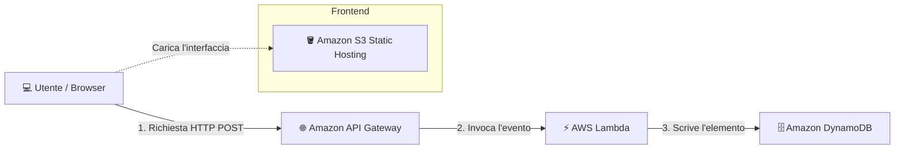

# 🚀 AWS Serverless Event Tracker

## 📌 Descrizione del Progetto

Progetto pratico focalizzato sulla progettazione e implementazione di un'architettura web **Serverless, scalable e event-driven** su Amazon Web Services (AWS) per il tracciamento delle visite in tempo reale.

Invece di utilizzare un server sempre attivo (come EC2), l'infrastruttura sfrutta un approccio **100% Serverless**: un frontend statico ospitato su **Amazon S3** invia richieste asincrone tramite **Amazon API Gateway**, scatenando l'esecuzione di una funzione **AWS Lambda** che gestisce la logica di backend e salva i record su **Amazon DynamoDB**.

---

## 🏗️ Architettura e Componenti

- **Amazon S3 (Static Website Hosting)**: Punto di ingresso del frontend. Ospita i file statici (`index.html`) rendendoli accessibili via web grazie a una Bucket Policy di lettura pubblica.
- **Amazon API Gateway (HTTP API)**: Gestisce l'endpoint HTTP (`/visit`), la configurazione dei permessi CORS (Cross-Origin Resource Sharing) e smista il traffico in entrata verso la funzione Lambda.
- **AWS Lambda**: Componente di calcolo serverless event-driven. Riceve la richiesta da API Gateway, genera un ID univoco con timestamp ed esegue la scrittura sul database NoSQL.
- **Amazon DynamoDB**: Database NoSQL fully-managed a chiavi-valore. Memorizza in modo persistente i dati delle visite ricevuti da Lambda con scalabilità automatica.
- **AWS IAM (Identity and Access Management)**: Ruolo di esecuzione dedicato applicato a Lambda per consentire la sola scrittura (`dynamodb:PutItem`) sulla tabella, garantendo il principio del minimo privilegio.

---

## 📐 Schema dell'Architettura


---

## 📷 Evidenze di Configurazione

### 1. Interfaccia Web Static Hosting (S3)


### 2. Rotta e Integrazione API Gateway


### 3. Record Salvati su Tabella DynamoDB


---

## 📜 Codice di Backend (AWS Lambda)

```import json
import boto3
import uuid
from datetime import datetime

# Inizializziamo il client DynamoDB
dynamodb = boto3.resource('dynamodb')
table = dynamodb.Table('UserVisits')

def lambda_handler(event, context):
    try:
        # 1. Generiamo un ID univoco e la data/ora corrente
        visit_id = str(uuid.uuid4())
        timestamp = datetime.now().isoformat()
        
        # 2. Estraiamo l'User-Agent dalle intestazioni HTTP se presente
        headers = event.get('headers', {}) or {}
        user_agent = headers.get('user-agent', 'Sconosciuto')
        
        # 3. Salva l'elemento nella tabella DynamoDB
        table.put_item(
            Item={
                'id': visit_id,
                'timestamp': timestamp,
                'user_agent': user_agent
            }
        )
        
        # 4. Risposta HTTP da restituire ad API Gateway
        return {
            'statusCode': 200,
            'headers': {
                'Content-Type': 'application/json',
                'Access-Control-Allow-Origin': '*'  # Abilita CORS
            },
            'body': json.dumps({
                'message': 'Visita registrata con successo!',
                'id': visit_id,
                'timestamp': timestamp
            })
        }
    except Exception as e:
        return {
            'statusCode': 500,
            'headers': {
                'Content-Type': 'application/json',
                'Access-Control-Allow-Origin': '*'
            },
            'body': json.dumps({'error': str(e)})
        }
